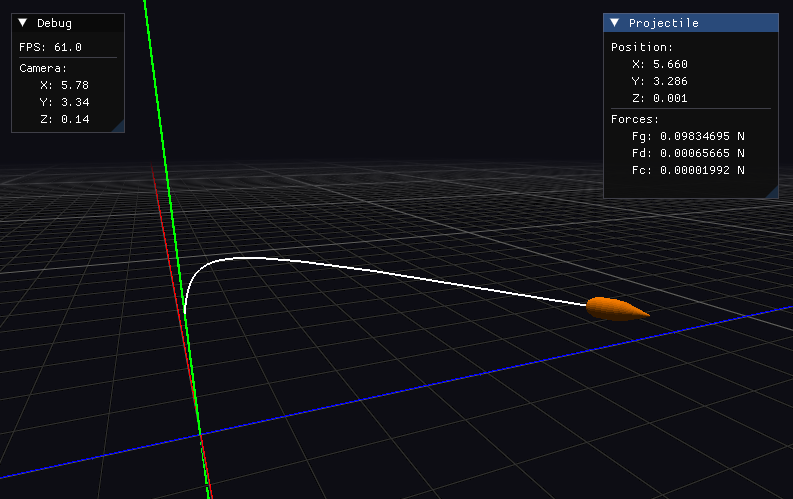

    

C/C++ physics engine primarily focused on ballistics. Also provides basic functionality if used as the only physical framework: rigid body dynamics and collision detection. It serves as a submodule of the custom [game engine](https://github.com/admtrv/BulletEngine) and can be regarded as a framework focused on ballistics and projectile motion.

    

