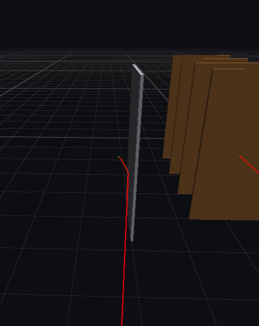
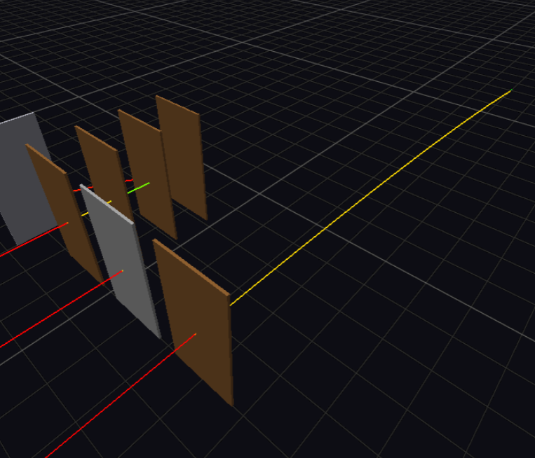
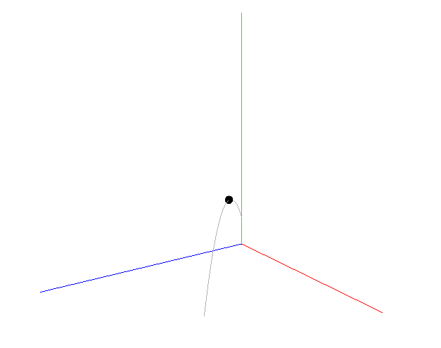
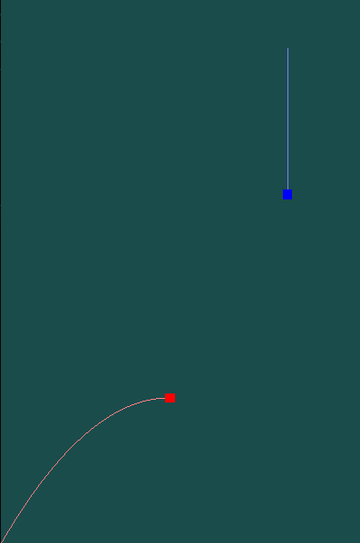
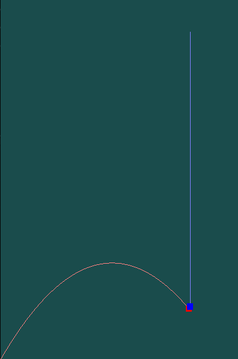

<p align="center">
    
</p>

## Modular and Engine-Independent Ballistic Framework

**BulletPhysics is a modular, engine-independent C/C++ framework for ballistic simulation.**
It covers external and terminal ballistics through step-by-step numerical integration. 
The framework also provides basic rigid body dynamics and collision detection, 
making it usable as a standalone physics layer. It is integrated as a submodule in a custom 
[game engine](https://github.com/admtrv/BulletEngine) and has been 
[ported to Godot](https://github.com/admtrv/BulletPhysicsGodot) as a GDExtension to prove integrability.

<p align="center">
    
</p>

## Designed for realism and reuse

Ballistic modeling directly affects gameplay consistency and player immersion, yet it is often reduced 
to simplified parabola motion or a custom in-house solution tied to a specific engine. Games 
like [Arma](https://www.youtube.com/watch?v=cix07R1vlhI) show what realistic ballistics can do for gameplay, 
but this level of fidelity shouldn't require building everything from scratch.

- **Physically grounded** - based on real physical laws, not approximations 
- **Numerically integrated** - Euler, Midpoint or RK4 for real-time simulation, choose depends on project requirements 
- **Modular component pipeline** - compose simulations of varying fidelity, from arcade games to realistic simulators
- **Engine-independent** - no dependencies on existing engines, integrates anywhere

Much as PhysX and Jolt made rigid body dynamics reusable, BulletPhysics aims to do the same for projectile 
physics: giving small teams and solo developers access to the same foundation without months of study research 
and implementation.

## Getting started

### Binary downloads

Prebuilt static library and headers are available on 
the [releases](https://github.com/admtrv/BulletPhysics/releases) page.

### Compiling from source

The project uses CMake and [CMakeLists.txt](CMakeLists.txt) is available. 
C++20 and GTest (for tests) are required.

```
cmake -B build
cmake --build build
ctest --test-dir build
```

### Documentation and demos

The [documentation](DOCUMENTATION.md) covers the API and integration workflow. Demo projects are available as [samples](https://github.com/admtrv/BulletEngine/tree/main/samples) in [BulletEngine](https://github.com/admtrv/BulletEngine) - the library's main testbed.

## Examples

<table>
<tr>
<td align="center"></td>
<td align="center"></td>
</tr>
<tr>
<td align="center">External ballistics (<a href="https://github.com/admtrv/BulletEngine/tree/main/samples/basic-external">basic-external</a>)</td>
<td align="center">Terminal ballistics: ricochet and penetrations (<a href="https://github.com/admtrv/BulletEngine/tree/main/samples/basic-terminal">basic-terminal</a>)</td>
</tr>
<tr>
<td align="center"></td>
<td align="center"></td>
</tr>
<tr>
<td align="center">Third-party 3D (<a href="https://github.com/zimka1/BulletPhysicsLibraryTest">source</a>)</td>
<td align="center">Applicable for 2D (<a href="https://github.com/zimka1/BulletPhysicsLibraryTest">source</a>)</td>
</tr>
</table>