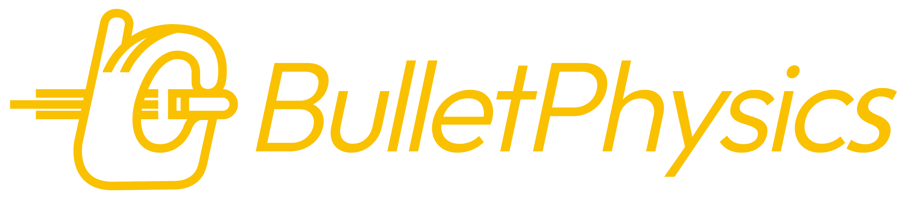
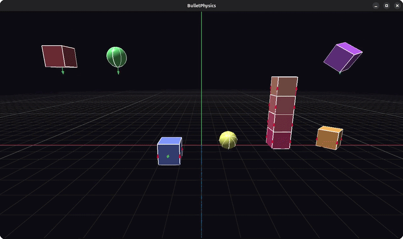

<p align="center">
    
</p>

Small but complete C++ physics engine. It works as a standalone physics library that can be plugged into any project that needs simulation, this way it serves as a submodule of the game engine.

<p align="center">
    
</p>

## Features

- **Bodies** carry mass and inertia tensor, come as dynamic, kinematic or static, take forces and torques
- **Constraints** freeze position or rotation along chosen axes
- **Colliders** of box, sphere and infinite ground, each holds a material, a layer and a mask
- **Materials** define friction and restitution
- **Islands** group bodies that touch and put them to sleep together
- **Timer** runs the simulation on a fixed step
- **Queries** cast rays and swept spheres through the world
- **Continuous detection** sweeps the path a fast body travels between steps
- **Triggers** report overlap without resolving it

## Structure

```
src/
├── collision/    shapes, materials, queries
├── dynamics/     world, bodies, solver
└── math/         vectors, matrices, quaternions
```

## Someday

Infrastructure for plugging in modules, and the modules themselves:

- **Joints**
- **Ragdolls**
- **Vehicles**
- **Destruction**
- **Ballistics**
